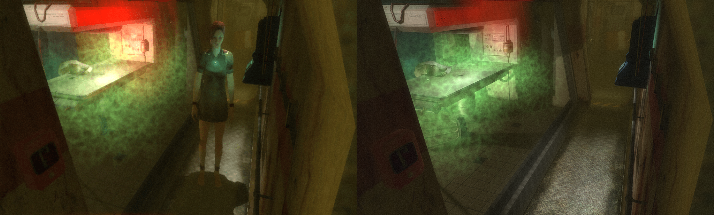
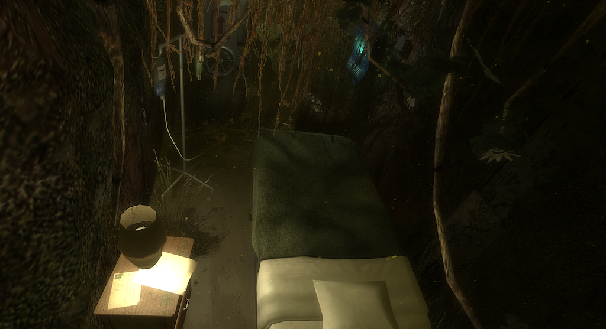
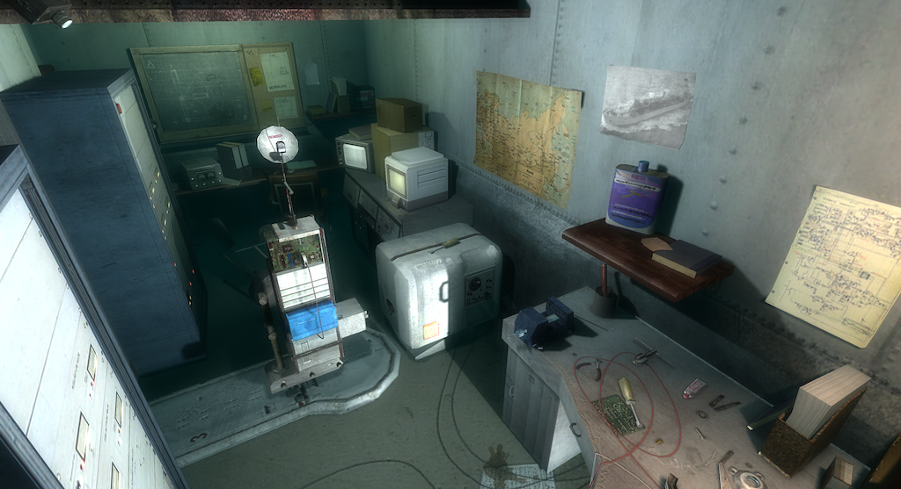
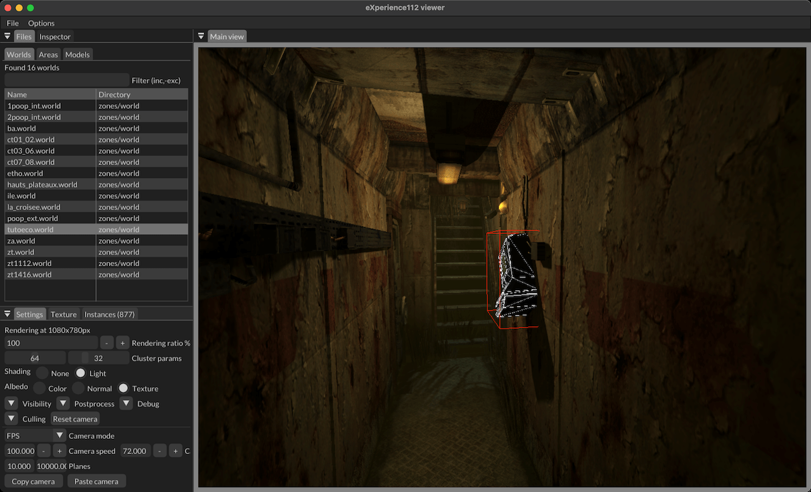
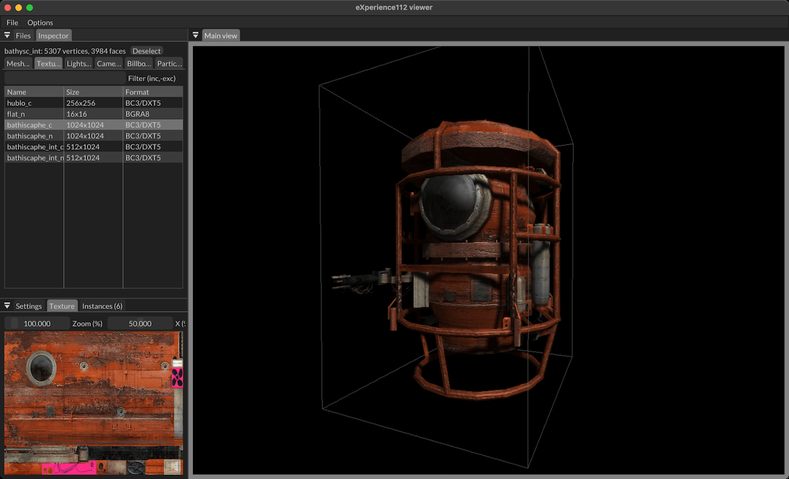

# eXplorer112

Viewer and exporter for level assets from the PC game eXperience112 (The Experiment). More details on my blog:

* [Understanding the game data](https://blog.simonrodriguez.fr/articles/2024/08/experimenting_with_experience_112.html)
* [Writing a new renderer](https://blog.simonrodriguez.fr/articles/2024/09/running_another_experience_112.html)

You will have to first extract the data using [Exp112ArcExtractor](https://github.com/dasbarr/Exp112ArcExtractor). When analysing the game renderer, [apitrace](http://apitrace.github.io) and my [DX9 capture replay](https://github.com/kosua20/apitrace-dx9-viewer) were useful.

## Comparison with the original game

Game left, renderer right:

## Results

## User interface

